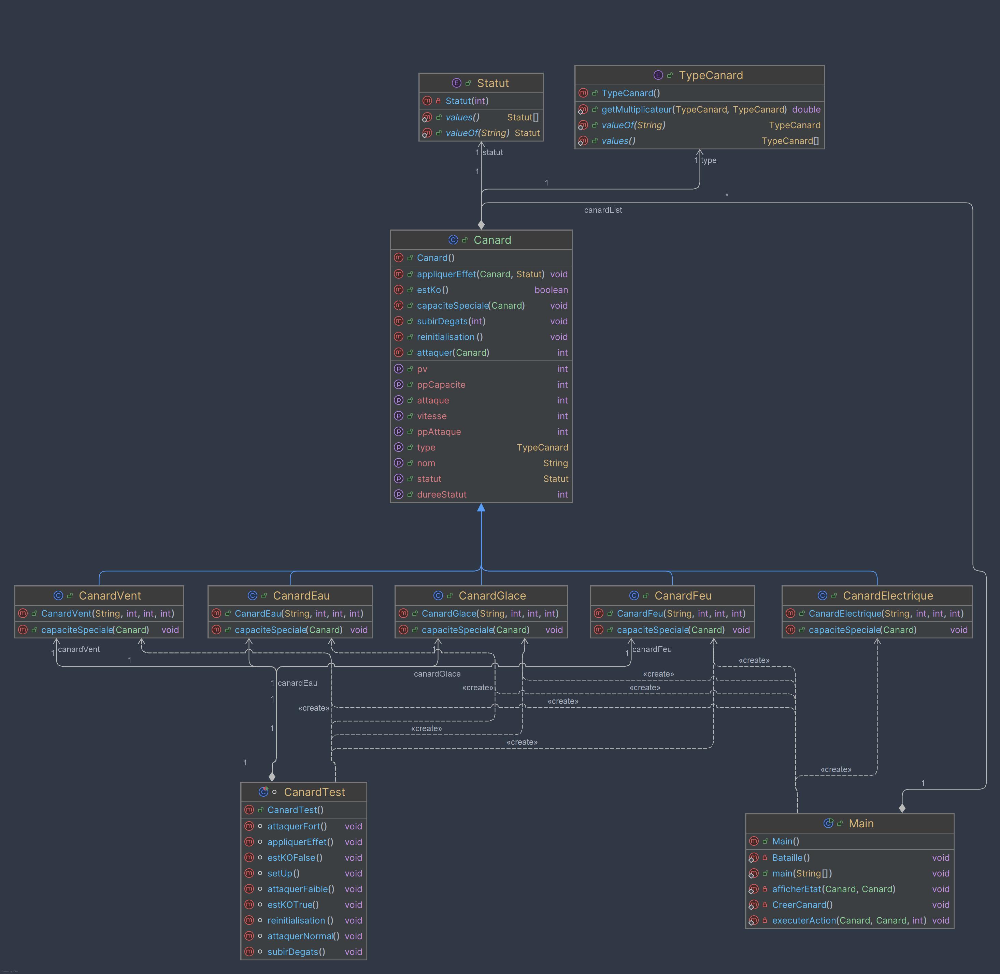

# Canard Fighter Simulator

## Diagramme de classes :

## Questions de modélisation :

## 1. Quelles classes pourraient être abstraites ?

La classe `Canard` pourrait être une classe abstraite. 
Car on ne peut pas avoir de Canard dans le jeu, il faut obligatoirement qu'il ait un type (Feu, Eau, Glace...).

## 2. Quels comportements communs pourraient être définis dans une interface ?

Les comportements communs qui pourraient être définis dans une interface sont les capacités spéciales des canards.

## 3. Comment représenter un changement de statut (par exemple, brûlé ou paralysé) dans la modélisation ?

On peut créer une nouvelle variable "statut" pour désigner l'état du canard qui sera une Enum contenant tous les statuts
(GEL, BRULURE...) et leurs durées. 

## 4. Quels seraient les avantages d’utiliser une classe ou une interface supplémentaire pour gérer les capacités spéciales ?

L'avantage serait de déplacer la gestion des capacités spéciales hors de la classe Canard.
Grâce à ça on pourrait ajouter des capacités spéciales et de les gérer plus facilement de plus cela permettraient de
mieux respecter le principe SOLID.

## 5. Quels défis sont associés à l’extensibilité de votre modèle pour ajouter de nouveaux types de canards ou de nouvelles capacités ?

La matrice des forces et faiblesses qui permet de calculer le multiplicateur à ajouter à l'attaque va grandir et 
donc l'initialisation prendra plus de temps (initialisation de la matrice = O(n²)).

Pour qu'un canard ait plusieurs capacités spéciales, il faut recréer une nouvelle méthode abstraite pour 
chaque capacité spéciale à rajouter, même si on veut rajouter une capacité qu'à un seul type.
